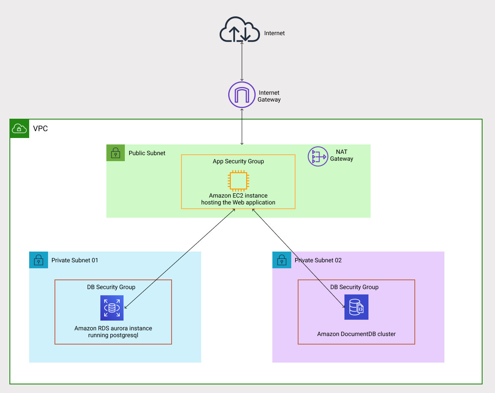

## About

---
Simple web application to showcase interactions with two database engines:
* Relational DB: PostgreSQL
* NoSQL DB: MongoDB

Application runs on port `8084`. APIs are exposed for creating and viewing person's info(name and address details):
* `/api/rds/persons`
* `/api/nosql/persons`

Sample payload:
```json
{
  "id": 1,
  "name": "Michael Scott",
  "address": {
    "line1": "#30, scranton business park",
    "line2": "",
    "city": "Scranton, Pennsylvania",
    "country": "USA"
  }
}
```

## Application Run Configurations

At the minimum, following properties should be updated either in:
* `application.yml` before building jar
  ```yaml
  spring:
    datasource:
      username: <UPDATE_THIS>
      password: <UPDATE_THIS>
      url: <UPDATE_THIS>
    data:
      mongodb:
        uri: <UPDATE_THIS>
  ```
* Or as environment variables while running the jar
  ```bash
  java -jar -Dspring.datasource.username=<UPDATE_THIS> -Dspring.datasource.password=<UPDATE_THIS> -Dspring.datasource.url=<UPDATE_THIS> -Dspring.data.mongodb.uri=<UPDATE_THIS> target/awsdemo-0.0.1-SNAPSHOT.jar 
  ```
* Or as environment variables while running the container
  ```bash
  podman run -e SPRING_DATASOURCE_URL=<UPDATE_THIS> -e SPRING_DATASOURCE_USERNAME=<UPDATE_THIS> -e SPRING_DATASOURCE_PASSWORD=<UPDATE_THIS> -e SPRING_DATA_MONGODB_URI=<UPDATE_THIS> --name awsdemo awsdemo:latest
  ```

## Local Setup

### Prerequisites
* [Podman](https://podman.io/getting-started/installation) / [Docker](https://docs.docker.com/engine/install/) / [Buildah](https://github.com/containers/buildah/blob/main/install.md) for container build and run
* A postgresql instance
    ```bash
  docker run -d -p 5432:5432 --restart=always -v $HOME/docker/volumes/postgres:/var/lib/postgresql/data --name postgres-13_3 -e POSTGRES_PASSWORD=postgres  -e POSTGRES_USER=postgres -e POSTGRES_DB=postgres postgres:13.3
  docker exec postgres-13_3 psql --username "postgres" --dbname "postgres" << SQLCMDS
  CREATE SCHEMA windstorm ;
  SQLCMDS
  ```
* A mongodb instance
    ```bash
    docker run --name mongodb -d -p 27017:27017 --restart=always -v $HOME/docker/volumes/mongodb:/data/db mongo
  ```
    
Optionally, install pgadmin and mongodb compass for UI. 

### Build
**Container builds can be done using any engine: docker / buildah / podman**
```bash
# JAR
mvn clean install -DskipTests

# Container -> this command builds on local. Re-tag for publishing to repository
podman build -t awsdemo:latest . 
```

### Run
**Containers can be run using any engine: docker / podman / containerd**
```bash
# JAR
java -jar -Dspring.profiles.active=local target/awsdemo-0.0.1-SNAPSHOT.jar

# Container
podman run --name awsdemo awsdemo:latest
```

## AWS setup

### Prerequisites

* [VPC](https://docs.aws.amazon.com/vpc/latest/userguide/vpc-getting-started.html) networking as defined in the diagram below.
* An [EC2](https://docs.aws.amazon.com/AWSEC2/latest/UserGuide/EC2_GetStarted.html) instance for running the application
* AWS [RDS](https://docs.aws.amazon.com/AmazonRDS/latest/AuroraUserGuide/CHAP_GettingStartedAurora.html) postgres instance
* AWS [documentDB](https://docs.aws.amazon.com/documentdb/latest/developerguide/getting-started.html) instance



### Deployment
* Install java on amazon linux EC2 instance:
  ```bash
  sudo amazon-linux-extras install java-openjdk11
  java -version
  ```
* Update `application.yml` with the DB instance connection details for RDS and DocumentDB
  * `spring.datasource` for rds
  * `spring.data.mongodb` for documentdb
* Build and copy the jar file onto the EC2 instance.
* Run using this command:
  ```bash
  java -jar awsdemo-0.0.1-SNAPSHOT.jar & > awsdemo.log
  ```
* Allow access to TCP port `8084` in the EC2 instance security group inbound rules.
* Application should be accessible on `http://<ec2_ip>:8084`
